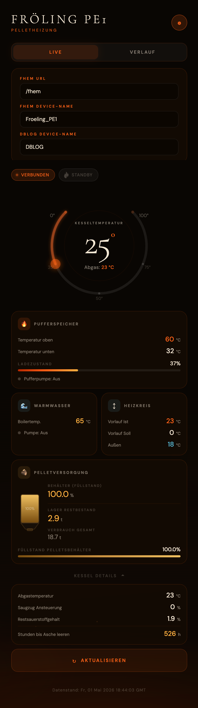

# 73_FroelingConnect.pm

FHEM-Modul für die **Fröling Connect Cloud-API** – holt Heizungs- und Kesseldaten direkt von `connect-api.froeling.com`, ohne einen lokalen Proxy-Server.

> Getestet mit: **Fröling PE1** (Pelletheizung)  
> Entwickelt als Ersatz für das bisherige Setup: `JsonMod` + MagicMirror-Modul [MMM-FroelingConnect](https://github.com/eckonator/MMM-FroelingConnect) als JSON-API-Server

---

## Inhalt

- [Funktionsweise](#funktionsweise)
- [Voraussetzungen](#voraussetzungen)
- [Installation](#installation)
- [Einrichtung](#einrichtung)
- [Attribute](#attribute)
- [Set-Befehle](#set-befehle)
- [Get-Befehle](#get-befehle)
- [Internals](#internals)
- [Readings](#readings)
- [Web App (optional)](#web-app-optional)
- [Beispiel-Konfiguration](#beispiel-konfiguration)
- [Hintergrund: API-Flow](#hintergrund-api-flow)

---

## Funktionsweise

Das Modul authentifiziert sich mit den Fröling Connect-Zugangsdaten (gleicher Login wie die mobile App) und ruft die Heizungsdaten direkt aus der Cloud ab. Der Ablauf:

```
Login → Anlagen-ID holen → Komponenten-Liste → Daten je Komponente → Readings schreiben
```

Der Bearer-Token wird alle 11,5 Stunden automatisch erneuert. Die Daten werden zyklisch im konfigurierten Intervall abgerufen.

---

## Voraussetzungen

- FHEM ab Version 6.x
- Perl-Module: `JSON`, `POSIX` (meist bereits installiert)
- `HttpUtils` (FHEM-intern, immer vorhanden)
- Fröling Connect-Konto (gleicher Login wie die [Fröling Connect App](https://www.froeling.com/de/service/froeling-connect/))
- Netzwerkzugang des FHEM-Servers zu `connect-api.froeling.com` (HTTPS, Port 443)

---

## Installation

1. `73_FroelingConnect.pm` in das FHEM-Modulverzeichnis kopieren:

```bash
cp 73_FroelingConnect.pm /opt/fhem/FHEM/
```

2. FHEM neu starten oder das Modul laden:

```
reload 73_FroelingConnect
```

---

## Web App (optional)

Eine touch-freundliche Bedienoberfläche ist unter `www/froeling/index.html` enthalten. Sie wird direkt auf den FHEM-Server deployt, damit sie die FHEM-API ohne CORS-Probleme aufrufen kann:



```bash
mkdir -p /opt/fhem/www/froeling
cp www/froeling/index.html /opt/fhem/www/froeling/index.html
```

Die App ist dann erreichbar unter:

```
http://<fhem-ip>:8083/fhem/www/froeling/index.html
```

Sie ruft automatisch `/fhem` als API-Basis-URL auf (gleicher Host, keine zusätzliche Konfiguration nötig). Falls deine FHEM-Instanz einen CSRF-Token verwendet (Standard seit FHEM 5.8), holt und sendet die App ihn automatisch mit.

> **Hinweis:** Falls dein FHEM-Webinterface ein abweichendes `webname`-Attribut verwendet (Standard: `fhem`), passe die URL entsprechend an. Die API-URL lässt sich auch über das Einstellungs-Icon in der App überschreiben.

---

## Einrichtung

### 1. Device anlegen

Nur der Benutzername (E-Mail-Adresse) wird im `define` angegeben:

```
define Froeling_PE1 FroelingConnect deine@email.de
```

### 2. Passwort setzen

Das Passwort wird **verschlüsselt** im internen FHEM-Schlüsselspeicher abgelegt und erscheint **nicht** in der Konfigurationsdatei:

```
set Froeling_PE1 password DeinPasswort
```

FHEM startet daraufhin automatisch den Login und beginnt mit dem Datenabruf.

### 3. Interval konfigurieren

```
attr Froeling_PE1 interval 5
```

---

## Attribute

| Attribut | Standard | Beschreibung |
|---|---|---|
| `interval` | `5` | Abfrage-Intervall in Minuten |
| `facilityIndex` | `0` | Index der Anlage (bei mehreren Anlagen im Account) |
| `disable` | `0` | `1` = alle Abfragen deaktivieren |
| `disabledForIntervals` | – | Abfragen in Zeitbereichen deaktivieren, z.B. `23:00-06:00` |
| `stateFormat` | – | Freie Formatierung des STATE-Wertes (FHEM-Standard) |
| `event-on-change-reading` | – | Nur bei Wertänderung Events erzeugen |

---

## Set-Befehle

| Befehl | Beschreibung |
|---|---|
| `set <name> password <Passwort>` | Passwort verschlüsselt speichern und Login starten |
| `set <name> update` | Sofortigen Datenabruf anstoßen |
| `set <name> relogin` | Session zurücksetzen und neuen Login erzwingen |

---

## Get-Befehle

| Befehl | Beschreibung |
|---|---|
| `get <name> update` | Sofortigen Datenabruf anstoßen |

---

## Internals

| Internal | Beschreibung |
|---|---|
| `API_LAST_MSG` | Letzter HTTP-Status-Code (200 = OK) |
| `API_LAST_RES` | Unix-Timestamp des letzten erfolgreichen Abrufs |
| `FACILITY_ID` | Interne Anlagen-ID des Fröling Connect-Accounts |
| `FACILITY_NAME` | Anzeigename der Anlage |
| `NEXT` | Zeitpunkt des nächsten geplanten Abrufs |
| `SOURCE` | API-Endpunkt + letzter Status |
| `USERNAME` | Konfigurierter Benutzername |
| `VERSION` | Modulversion |

---

## Readings

Die Readings sind nach Heizungskomponenten gruppiert. Der Präfix wird aus dem Anzeigenamen der Komponente abgeleitet (Kleinbuchstaben, Leerzeichen entfernt, Umlaute ersetzt):

| Komponente | Readings-Präfix |
|---|---|
| Kessel | `kessel` |
| Austragung | `austragung` |
| Puffer 01 | `puffer01` |
| Boiler 01 | `boiler01` |
| Heizkreis 01 | `heizkreis01` |

Jeder Parameter einer Komponente erzeugt folgende Readings (`N` = laufender Index):

| Reading | Beschreibung |
|---|---|
| `{präfix}.N.value` | **Messwert** (der wichtigste Reading) |
| `{präfix}.N.unit` | Einheit (`°C`, `%`, `t`, `kg`, `h`, …) |
| `{präfix}.N.displayName` | Anzeigename des Parameters |
| `{präfix}.N.name` | Technischer Name (z.B. `boilerTemp`) |
| `{präfix}.N.parameterType` | Datentyp (`NumValueObject`, `StringValueObject`) |
| `{präfix}.N.editable` | `1` = Wert ist über die App änderbar |
| `{präfix}.N.id` | Interne Parameter-ID der API |
| `{präfix}.N.maxVal` | Maximalwert |
| `{präfix}.N.minVal` | Minimalwert |
| `{präfix}.N.notificationConfigurable` | Push-Benachrichtigungen konfigurierbar |
| `{präfix}.N.stringListKeyValues.K` | Auswahlliste (z.B. `0`=NEIN, `1`=JA) |
| `lastUpdate` | UTC-Zeitstempel des letzten Abrufs |

### Wichtige Readings für die Fröling PE1

```
# Austragung (Pellets)
austragung.0.value    # Füllstand im Pelletsbehälter    [%]
austragung.4.value    # Pelletlager Restbestand          [t]
austragung.6.value    # Pelletverbrauch gesamt           [t]

# Boiler (Warmwasser)
boiler01.0.value      # Boilertemperatur oben            [°C]
boiler01.1.value      # Boilerpumpe Ansteuerung          [%]

# Heizkreis
heizkreis01.0.value   # Vorlauf-Isttemperatur            [°C]
heizkreis01.1.value   # Vorlauf-Solltemperatur           [°C]
heizkreis01.2.value   # Außentemperatur                  [°C]

# Kessel
kessel.0.value        # Kesseltemperatur                 [°C]
kessel.1.value        # Abgastemperatur                  [°C]
kessel.2.value        # Verbl. Heizstunden bis Asche     [h]
kessel.3.value        # Saugzug - Ansteuerung            [%]
kessel.4.value        # Restsauerstoffgehalt             [%]

# Puffer
puffer01.0.value      # Puffertemperatur oben            [°C]
puffer01.1.value      # Puffertemperatur unten           [°C]
puffer01.2.value      # Pufferladezustand                [%]
puffer01.3.value      # Pufferpumpen Ansteuerung         [%]
```

---

## Beispiel-Konfiguration

```perl
# Device anlegen
define Froeling_PE1 FroelingConnect deine@email.de
# Passwort einmalig setzen (nicht in der Config-Datei!)
# set Froeling_PE1 password DeinPasswort
attr Froeling_PE1 interval 5
attr Froeling_PE1 alias Froeling PE1 Pelletheizung
attr Froeling_PE1 event-on-change-reading austragung.0.value,austragung.4.value,austragung.6.value,boiler01.0.value,boiler01.1.value,heizkreis01.0.value,heizkreis01.1.value,heizkreis01.2.value,kessel.0.value,kessel.1.value,kessel.2.value,kessel.3.value,kessel.4.value,puffer01.0.value,puffer01.1.value,puffer01.2.value,puffer01.3.value
attr Froeling_PE1 stateFormat {my $r = ReadingsVal($name,"austragung.4.value","--");; my $f = ReadingsVal($name,"austragung.0.value","--");; "Pelletlager Restbestand: $r t | Füllstand im Pelletsbehälter: $f %"}
```

---

## Hintergrund: API-Flow

Das Modul repliziert den API-Ablauf des [MMM-FroelingConnect](https://github.com/eckonator/MMM-FroelingConnect) MagicMirror-Moduls, der durch Code-Analyse des `node_helper.js` ermittelt wurde:

```
POST https://connect-api.froeling.com/app/v1.0/resources/loginNew
  Body: { osType: "IOS", userName: "...", password: "..." }
  → Response: JSON (userId) + HTTP-Header "Authorization: Bearer <token>"

GET  https://connect-api.froeling.com/app/v1.0/resources/user/getFacilities
  → [ { id: <facilityId>, name: "...", ... } ]

GET  https://connect-api.froeling.com/fcs/v1.0/resources/user/<userId>/facility/<facilityId>/componentList
  → [ { componentId, displayName, displayCategory, ... } ]

GET  https://connect-api.froeling.com/fcs/v1.0/resources/user/<userId>/facility/<facilityId>/component/<componentId>
  → { displayName: "Kessel", stateView: [ { name, displayName, value, unit, ... } ] }
  (wiederholt für jede Komponente)
```

Der Bearer-Token ist ca. 12 Stunden gültig. Das Modul erneuert ihn automatisch alle 11,5 Stunden.

---

## Lizenz

GPL v2 – siehe [LICENSE](LICENSE)

## Autor

Markus Eckert · [github.com/eckonator](https://github.com/eckonator)
